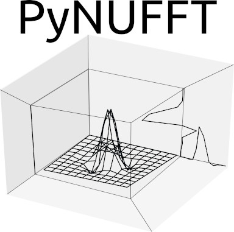
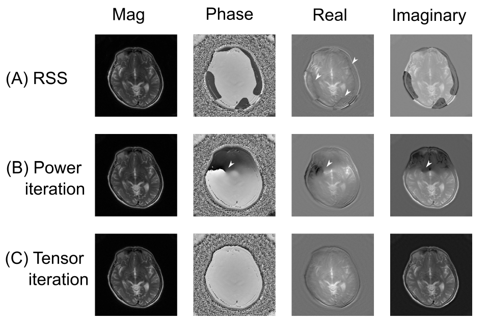
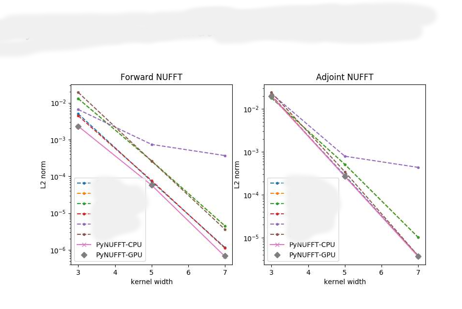

# PyNUFFT: Python non-uniform fast Fourier transform



A minimal "getting start" tutorial is available at http://jyhmiinlin.github.io/pynufft/ . This package reimplements the min-max interpolator (Fessler, Jeffrey A., and Bradley P. Sutton. "Nonuniform fast Fourier transforms using min-max interpolation." IEEE transactions on signal processing 51.2 (2003): 560-574.) for Python.


### News

Add experimental support for cupy, PyTorch and TensorFlow Eager mode with test files. 

### Some recent research works using PyNUFFT (Thank you!)

https://iopscience.iop.org/article/10.1088/1361-6560/ab9358/meta (deep learning)

https://arxiv.org/abs/2103.09203 (deep learning)

https://aapm.onlinelibrary.wiley.com/doi/10.1002/mp.14809 (deep learning)

https://ieeexplore.ieee.org/stamp/stamp.jsp?arnumber=8579232 (deep learning)

https://joss.theoj.org/papers/10.21105/joss.02825 (gravitational lens)

https://pubmed.ncbi.nlm.nih.gov/33906008/ (tomographic imaging)

https://joss.theoj.org/papers/10.21105/joss.02578 (Off-resonance CorrecTion OPen soUrce Software)

Chen HC, Yang HC, Chen CC, Harrevelt S, Chao YC, Lin JM, Yu WH, Chang HC, Chang CK, Hwang FN.
Improved Image Quality for Static BLADE Magnetic Resonance Imaging Using the Total-Variation Regularized Least Absolute Deviation Solver.
Tomography. 2021 Oct 8;7(4):555-572. doi: 10.3390/tomography7040048. PMID: 34698286; PMCID: PMC8544655.
(https://pubmed.ncbi.nlm.nih.gov/34698286/) (We used pynufft to perform BLADE MRI reconstruction. No singularity in the coil sensitivity profiles)



Please remind us if there are other publications.


## Installation

$ pip3 install pynufft --user


### Using Numpy/Scipy

```
$ python
Python 3.6.11 (default, Aug 23 2020, 18:05:39) 
[GCC 7.5.0] on linux
Type "help", "copyright", "credits" or "license" for more information.
>>> from pynufft import NUFFT
>>> import numpy
>>> A = NUFFT()
>>> om = numpy.random.randn(10,2)
>>> Nd = (64,64)
>>> Kd = (128,128)
>>> Jd = (6,6)
>>> A.plan(om, Nd, Kd, Jd)
0
>>> x=numpy.random.randn(*Nd)
>>> y = A.forward(x)
```

### Using PyCUDA

```
>>> from pynufft import NUFFT, helper
>>> import numpy
>>> A2= NUFFT(helper.device_list()[0])
>>> A2.device
<reikna.cluda.cuda.Device object at 0x7f9ad99923b0>
>>> om = numpy.random.randn(10,2)
>>> Nd = (64,64)
>>> Kd = (128,128)
>>> Jd = (6,6)
>>> A2.plan(om, Nd, Kd, Jd)
0
>>> x=numpy.random.randn(*Nd)
>>> y = A2.forward(x)
```

### Using Pytorch CPU (experimental)
```
>>> from pynufft import NUFFT_torch, helper
>>> import numpy
>>> A2= NUFFT_torch()
>>> A2= NUFFT_torch()
KeyboardInterrupt
>>> om = numpy.random.randn(10,2)
>>> Nd = (64,64)
>>> Kd = (128,128)
>>> Jd = (6,6)
>>> A2.plan(om, Nd, Kd, Jd)
0
>>> x=numpy.random.randn(*Nd)
>>> y = A2.forward(x)
>>> x2 = A2.adjoint(y)
>>> x2.shape
torch.Size([64, 64])
>>> y.shape
torch.Size([10])
```

### Using TensorFlow CPU Eager mode (experimental)
```
>>> from pynufft import NUFFT_tf_eager, helper
>>> import numpy
>>> A2= NUFFT_tf_eager()
>>> om = numpy.random.randn(10,2)
>>> A2.plan(om, Nd, Kd, Jd)
2022-09-05 12:19:33.954058: I tensorflow/core/platform/cpu_feature_guard.cc:193] This TensorFlow binary is optimized with oneAPI Deep Neural Network Library (oneDNN) to use the following CPU instructions in performance-critical operations:  AVX2 FMA
To enable them in other operations, rebuild TensorFlow with the appropriate compiler flags.
0
>>> x=numpy.random.randn(*Nd)
>>> y = A2.forward(x)
>>> x2 = A2.adjoint(y)
>>> x2.shape 
TensorShape([64, 64])
>>> y.shape
TensorShape([10])
```


## Testing GPU acceleration

```
Python 3.6.11 (default, Aug 23 2020, 18:05:39) 
[GCC 7.5.0] on linux
Type "help", "copyright", "credits" or "license" for more information.
>>> from pynufft import tests
>>> tests.test_init(0)
device name =  <reikna.cluda.cuda.Device object at 0x7f41d4098688>
0.06576069355010987
0.006289639472961426
error gx2= 2.0638987e-07
error gy= 1.0912560261408778e-07
acceleration= 10.455399523742015
17.97926664352417 2.710083246231079
acceleration in solver= 6.634211944790991
```

## Test Torch, TensorFlow and cupy (experimental)

```
Python 3.10.4 (main, Jun 29 2022, 12:14:53) [GCC 11.2.0] on linux
Type "help", "copyright", "credits" or "license" for more information.
>>> from pynufft import tests as t
>>> t.test_torch()
/home/sram/.local/lib/python3.10/site-packages/pynufft-2022.2.3rc1-py3.10.egg/pynufft/tests/test_torch.py:173: UserWarning: Module pynufft was already imported from /home/sram/.local/lib/python3.10/site-packages/pynufft-2022.2.3rc1-py3.10.egg/pynufft/__init__.py, but /home/sram/github/pynufft_online is being added to sys.path
  import pkg_resources
Forward Error between torch and numpy 1.5022443208777513e-07
Adjoint Error between torch and numpy 2.091061e-07
>>> t.test_tf_eager()
2022-09-05 12:15:50.556015: I tensorflow/core/platform/cpu_feature_guard.cc:193] This TensorFlow binary is optimized with oneAPI Deep Neural Network Library (oneDNN) to use the following CPU instructions in performance-critical operations:  AVX2 FMA
To enable them in other operations, rebuild TensorFlow with the appropriate compiler flags.
Forward error between tf and numpy 1.801203473553717e-06
Adjoint Error between tf and numpy 3.861161e-06
>>> t.test_cupy()
Forward Error between cupy and numpy 2.2403478444672691e-07
Adjoint Error between cupy and numpy 2.1125161308793866e-07
```

### Comparisons



The comparison may not imply the clinical quality of third-party packages.

### Contact information
If you have professional requests related to the project, please contact
email: pynufft@gmail.com

### Recent NUFFT functions available in Python

You can also find other very useful Python nufft/nfft functions at:

1. SigPy (Ong, F., and M. Lustig. "SigPy: a python package for high performance iterative reconstruction." Proceedings of the ISMRM 27th Annual Meeting, Montreal, Quebec, Canada. Vol. 4819. 2019. Note the order starts from the last axi>
2. gpuNUFFT: (Knoll, Florian, et al. "gpuNUFFT-an open source GPU library for 3D regridding with direct Matlab interface." Proceedings of the 22nd annual meeting of ISMRM, Milan, Italy. 2014.): https://github.com/andyschwarzl/gpuNUFFT/>
3. mrrt.nufft (mrrt.mri demos for the ISMRM 2020 Data Sampling Workshop in Sedona, AZ with raw cuda kernels): https://github.com/mritools/mrrt.nufft
4. pyNFFT (Keiner, J., Kunis, S., and Potts, D. ''Using NFFT 3 - a software library for various nonequispaced fast Fourier transforms'' ACM Trans. Math. Software,36, Article 19, 1-30, 2009. The python wrapper of NFFT): https://pythonho>
5. python-NUFFT: Please see: https://github.com/dfm/python-nufft, "Python bindings by Dan Foreman-Mackey, Thomas Arildsen, and Marc T. Henry de Frahan but the code that actually does the work is from the Greengard lab at NYU (see the w>
6. finufft (Barnett, Alexander H., Jeremy Magland, and Ludvig af Klinteberg. "A Parallel Nonuniform Fast Fourier Transform Library Based on an “Exponential of Semicircle" Kernel." SIAM Journal on Scientific Computing 41.5 (2019): C479->
7. torchkbnufft (M. J. Muckley, R. Stern, T. Murrell, F. Knoll, TorchKbNufft: A High-Level, Hardware-Agnostic Non-Uniform Fast Fourier Transform, 2020 ISMRM Workshop on Data Sampling and Image Reconstruction): https://github.com/mmuckl>
8. tfkbnufft (adapt torchkbnufft for TensorFlow): https://github.com/zaccharieramzi/tfkbnufft
9. TFNUFFT (adapt the min-max interpolator in PyNUFFT for tensorflow): https://github.com/yf0726/TFNUFFT
10. tensorflow-nufft: https://github.com/mrphys/tensorflow-nufft

