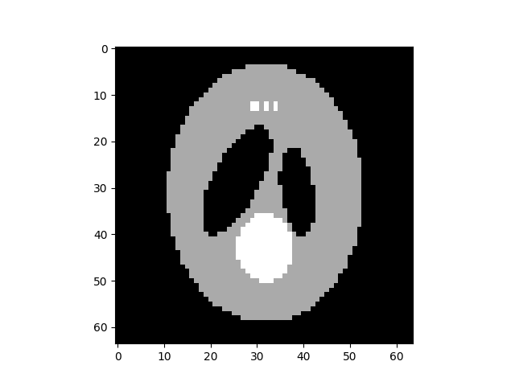

Multi-dimensional NUFFT
=======================
Multi-dimensional transforms are supported in PyNUFFT. 

---------------------
Parameters of PyNUFFT
---------------------

Here we summarize the required variables in :numref:`parameter_table`

.. _parameter_table:
.. list-table:: Title
   :widths: 10 10 60 20
   :header-rows: 1

   * - Heading row 1, column 1
     - Heading row 1, column 2
     - Heading row 1, column 3
     - 
   * - Row 1, column 1
     -
     - Row 1, column 3
     - 
   * - Row 2, column 1
     - Row 2, column 2
     - Row 2, column 3
     - 

**Non-Cartesian coordinates (om)**

om is an numpy array with a shape of (M, dim). 
M is  the number of non-Cartesian samples, dim is the dimensionality. 
The dtype of om is float.  om is normalized between :math:`[-\pi, \pi]`. 

**Image grid size (Nd)**

The image grid determines the size of the image. 

**Oversampled Fourier grid (Kd)**

The oversampled Fourier grid determines the size of the frequency. 
Normally the Kd is 2 × Nd[d] for d-th axis. 

**Interpolator size (Jd)**

The interpolator computes the Jd[d] adjacent weighted sum of the oversampled Fourier grid.
A normal choice of Jd is 6 for all axes.  
 
Optionally, user can provide additional variables:
 
**ft_axes (default = None (all axes))**

ft_axes the NUFFT_cpu to operate the FFT on the given axes.
 
**batch (deprecated)**

Batch mode allows NUFFT to operate on the additional axis. 
 
 
:numref:`anatomy_nufft` illustrates the variables for 1D, 2D, 3D NUFFT.

.. _anatomy_nufft:

.. figure:: ../figure/anatomy_nufft.png
   :width: 60%
   
   The anatomy of 1D, 2D, and 3D NUFFT. 
   (A) 1D NUFFT: om is a numpy.array of the shape (M,1). 
   M is the number of non-Cartesian points. 
   Nd = (8, ) is the image domain grid size and Kd = (16, ) is the oversampled grid size. 
   Jd = (6, ) is the interpolator size.
   (B) 2D NUFFT: om is a numpy.array of the shape (M,2). 
   M is the number of non-Cartesian points. 
   Nd = (8, 8 ) is the image domain grid size and Kd = (16, 16 ) is the oversampled grid size. 
   Jd = (6, 6 ) is the interpolator size.   
   (C) 3D NUFFT: om is a numpy.array of the shape (M,3). 
   M is the number of non-Cartesian points. 
   Nd = (8, 8, 8 ) is the image domain grid size and Kd = (16, 16, 16 ) is the oversampled grid size. 
   Jd = (6, 6, 6 ) is the interpolator size.      

**Import pynufft module**

In python environment, import pynufft module and other packages::
   
   
   import numpy 
   import scipy.misc
   import matplotlib.pyplot 
   
   from pynufft import NUFFT_cpu
   

  
 
    
 
**Planning**
Create a pynufft object NufftObj::

   from pynufft import NUFFT_cpu, NUFFT_hsa
   NufftObj = NUFFT_cpu()
   

   
Provided :math:`om`, the size of time series (:math:`Nd`), oversampled grid (:math:`Kd`), and interpolatro size (:math:`Jd`) are:: 
    
   Nd = (64,64,64) # time grid, tuple
   Kd = (64,64,64) # frequency grid, tuple
   Jd = (1,1,1) # interpolator 
   #     om=       numpy.load(DATA_PATH+'om3D.npz')['arr_0']
   om = numpy.random.randn(15120,3)
   print(om.shape)

Now we can plan NufftObj with these parameters::
    
   NufftObj.plan(om, Nd, Kd, Jd)

**Forward transform**

Now NufftObj has been prepared and is ready for computations. Continue with an example.::
   
  
   import pkg_resources
   DATA_PATH = pkg_resources.resource_filename('pynufft', './src/data/')   
   image = numpy.load(DATA_PATH +'phantom_3D_128_128_128.npz')['arr_0'][0::2, 0::2, 0::2]
   print(special_license)
    

This display the image :numref:`3d_example_image`.

.. _3d_example_image:

   The 3D phantom
   
   
   
NufftObj transform the time_data to non-Cartesian locations::

   y = NufftObj.forward(image)
   
**Image restoration with solve()**: 

The image can be restored from non-Cartesian samples y::

   restore_image = NufftObj.solve(kspace,'cg', maxiter=500)
   
   restore_image1 = NufftObj.solve(kspace,'L1TVLAD', maxiter=500,rho=0.1)
   # 
   restore_image2 = NufftObj.solve(kspace,'L1TVOLS', maxiter=500,rho=0.1)
   pyplot.subplot(2,2,1)
   pyplot.imshow(numpy.real(image[:,:,32]), label='original signal',cmap=gray)
   pyplot.title('original')    
   pyplot.subplot(2,2,2)
   pyplot.imshow(numpy.real(restore_image1[:,:,32]), label='L1TVLAD',cmap=gray)
   pyplot.title('L1TVLAD')
   pyplot.subplot(2,2,3)
   pyplot.imshow(numpy.real(restore_image2[:,:,32]), label='L1TVOLS',cmap=gray)
   pyplot.title('L1TVOLS')
   pyplot.subplot(2,2,4)
   pyplot.imshow(numpy.real(restore_image[:,:,32]), label='CG',cmap=gray)
   pyplot.title('CG')
   
    
   
.. _2D_restore:

.. figure:: ../figure/3D_ restore.png
   :width: 100 %

   Image restoration using'cg', 'L1TVOLS', 'L1TVLAD'.
   
   

   
   
#.. literalinclude::  ../../../example/script_3D.py
   
