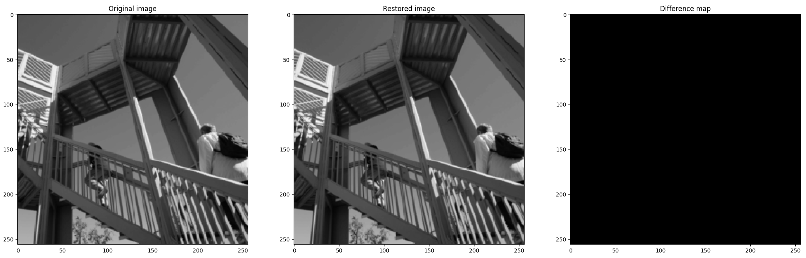
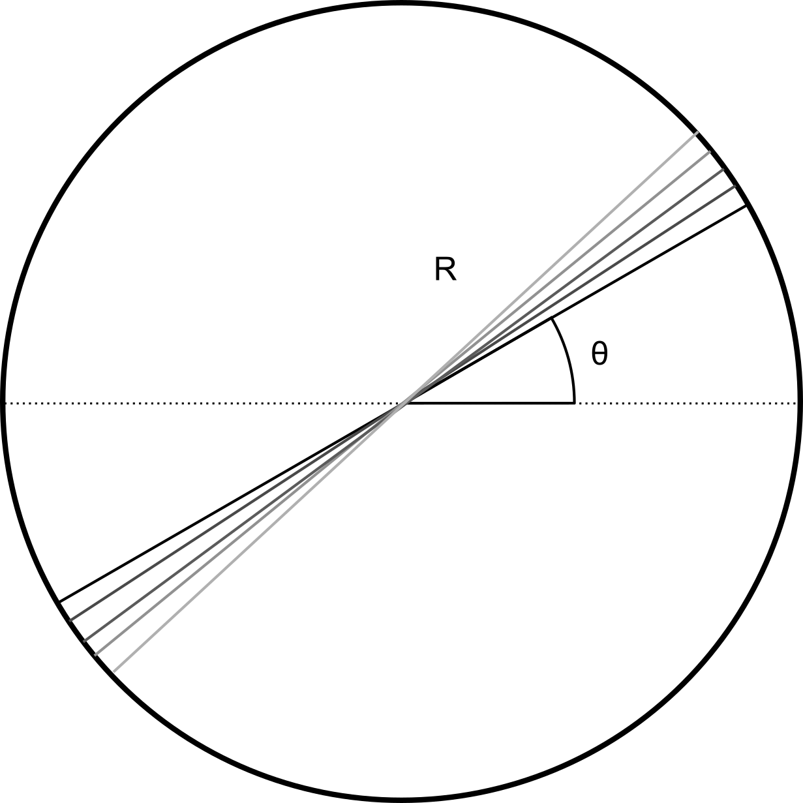

=========================
k-Space trajectories (om)
=========================

-----------------
Cartesian k-space
-----------------
This section aims to provide a good example to show that NUFFT can be used to compute many different trajectories, including the Cartesian k-space. 

However, Cartesian k-space should mostly be computed by FFT and this section is provided only for testing. 

In the example, we generate a PyNUFFT object and make a plan using Cartesian k-space, followed by the NUFFT transform. 

The data is created by NUFFT but on the Cartesian grid. 

Last the Cartesian data are transformed back to image by IFFT (with two ifftshifts before and after ifftn)::

   # Generating trajectories for Cartesian k-space
   import numpy
   import matplotlib.pyplot
   matplotlib.pyplot.gray()
   
   def fake_Cartesian(Nd):
       dim = len(Nd) # dimension
       M = numpy.prod(Nd)
       om = numpy.zeros((M, dim), dtype = numpy.float)
       grid = numpy.indices(Nd)
       for dimid in range(0, dim):
           om[:, dimid] = (grid[dimid].ravel() *2/ Nd[dimid] - 1.0)*numpy.pi
       return om    
    
   import scipy.misc
   
   from pynufft import NUFFT
   
   
   Nd = (256,256)
   Kd = (512,512)
   Jd = (6,6)
   
   image = scipy.misc.ascent()[::2,::2]
   om = fake_Cartesian(Nd)
   
   
   print('Number of samples (M) = ', om.shape[0])
   print('Dimension = ', om.shape[1])
   print('Nd = ', Nd)
   print('Kd = ', Kd)
   print('Jd = ', Jd)
   
   NufftObj = NUFFT()
   NufftObj.plan(om, Nd, Kd, Jd)
   y = NufftObj.forward(image)
   
   y2 = y.reshape(Nd, order='C') 
   x2 = numpy.fft.ifftshift(numpy.fft.ifftn(numpy.fft.ifftshift(y2)))
   matplotlib.pyplot.subplot(1,3,1)
   matplotlib.pyplot.imshow(image.real, vmin = 0, vmax = 255)
   matplotlib.pyplot.title('Original image')
   matplotlib.pyplot.subplot(1,3,2)
   matplotlib.pyplot.imshow(x2.real, vmin = 0, vmax = 255)
   matplotlib.pyplot.title('Restored image')
   matplotlib.pyplot.subplot(1,3,3)
   matplotlib.pyplot.imshow(abs(image - x2), vmin = 0, vmax = 255)
   matplotlib.pyplot.title('Difference map')
   matplotlib.pyplot.show()
   
As you can see, the resulting images (:numref:`fake-Cartesian`) confirm that NUFFT + IFFT can restore the original image. 

.. _fake-Cartesian:

   A Cartesian example generates the contrived Cartesian data using NUFFT, followed by IFFT.  

--------------
Radial k-space
--------------

We can generate the radial spokes on the 2D plane. 
Each radial spoke spans the range of  :math:`[-\pi, \pi]` at the angle :math:`\theta` and each point is fully determined by the  polar coordinate (R, :math:`\theta`).
See :numref:`radial_spoke` for more information.

.. _radial_spoke:

   
   Illustration of five radial spokes. 
   Each point of the spoke can be described by the polar coordinate (R, :math:`\theta`), 
   which can be transformed to Cartesian coordinates (R cos(:math:`\theta`), R sin(:math:`\theta`)). 

The following code generates 360 radial spokes::

   # generating 2D radial coordinates
   import numpy
   
   spoke_range = (numpy.arange(0, 512) - 256.0 )* numpy.pi/ 256  # normalized between -pi and pi
   M = 512*360
   om = numpy.empty((M,2), dtype = numpy.float32)
   
   
   for angle in range(0, 360):
      radian = angle * 2 * numpy.pi/ 360.0   
      spoke_x =  spoke_range * numpy.cos(radian)
      spoke_y =  spoke_range * numpy.sin(radian)
      om[512*angle : 512*(angle + 1) ,0] = spoke_x
      om[512*angle : 512*(angle + 1) ,1] = spoke_y

   import matplotlib.pyplot
   matplotlib.pyplot.plot(om[:,0], om[:,1],'.')
   matplotlib.pyplot.show()
