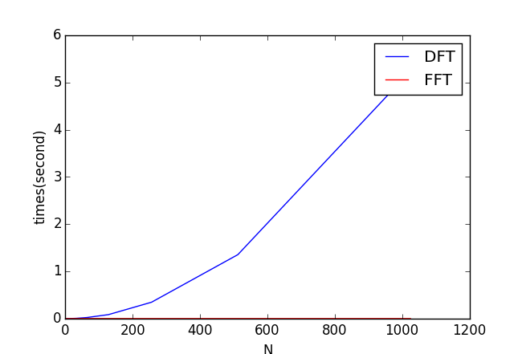

Fast Fourier transform (FFT)
============================

**Fast Fourier transform (FFT)**

However, DFT is slow: the computation times of DFT is proportional to the square of the length of the series (:math:`N^2`).

Fast Fourier transform (FFT) performs a very efficient DFT. The speed of FFT is far faster than DFT. FFT has a complexity of :math:`O(Nlog2(N))`.

**Comparison of DFT and FFT**

The following code compare

Create a *dft_benchmark.py* and measure the execution times of DFT function:
   
.. literalinclude::  ../codes/dft_benchmark.py

The vast differrent performance of DFT and FFT can be seen in the following graph:

