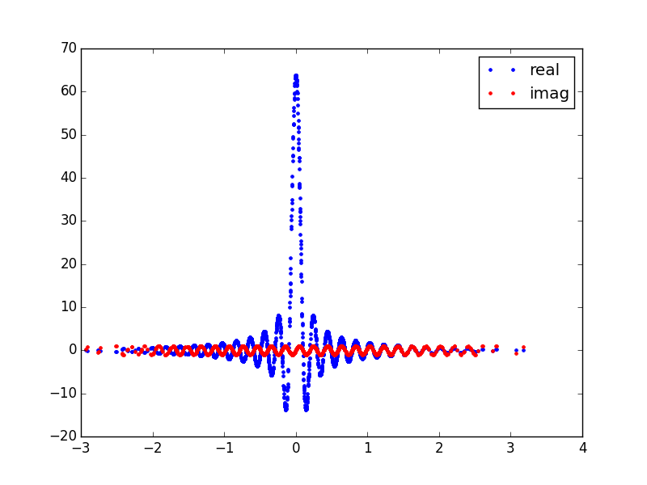
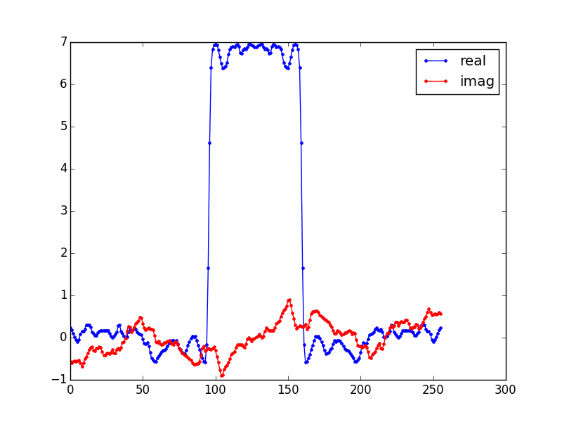

An 1D example
=============
**Import pynufft module**

In python environment, import pynufft module::
   
   import pynufft.pynufft as pnft
   
Create a pynufft object NufftObj::

   NufftObj = pnft.NUFFT()
  
We provide the required information in the next sections.

**Planning**

The :math:`M` locations of non-uniform samples (:math:`om`) must be provided::

    import numpy
    om = numpy.random.randn(1512,1) 
    # om is an M x 1 ndarray: locations of M points. *om* is normalized between [-pi, pi]
    # Here M = 1512

Also, the size of time series (:math:`Nd`), oversampled grid (:math:`Kd`), and interpolatro size (:math:`Jd`) are:: 
    
    Nd = (256,)
    Kd = (512,)
    Jd = (6,)

Now provide NufftObj with these parameters::
    
    NufftObj.plan(om, Nd, Kd, Jd) 

**Forward transform**

Now NufftObj has been prepared and is ready for computations. Let continue with an example.::
   
   import numpy
   import matplotlib.pyplot as pyplot
   time_data = numpy.zeros(256, )
   time_data[96:128+32] = 1.0
   pyplot.plot(time_data)
   pyplot.ylim(-1,2)
   pyplot.show()

This generates a time series :numref:`box_function`.

.. _box_function:

.. figure:: ../figure/box_function.png
   :width: 50 %

   A box function time series
   
NufftObj transform the time_data to non-Cartesian locations::

   y = NufftObj.forward(time_data) 
   pyplot.plot(om,y.real,'.', label='real') 
   pyplot.plot(om,y.imag,'r.', label='imag') 
   pyplot.legend()
   pyplot.show()  

This display the non-Cartesian spectrum :numref:`non_Cartesian_spectrum`.

.. _non_Cartesian_spectrum:

   Non-Cartesian spectrum of box function in :numref:`box_function`. Note the non-uniform density.
   
**Adjoint transform**

The adjoint transform is the reverse of forward transform::

   x2 = NufftObj.adjoint(y) 
   pyplot.plot(x2.real,'.-', label='real') 
   pyplot.plot(x2.imag,'r.-', label='imag') 
   pyplot.plot(time_data,'k',label='original signal')
   pyplot.ylim(-1,2)
   pyplot.legend()
   pyplot.show() 

There are some distortions in the adjoint operation :numref:`adjoint`. It does NOT recover the rectangular function in :numref:`box_function`.

.. _adjoint:

   Adjoint transform of non-Cartesian spectrum.
   
   
**Inverse transform through density compensation**

The inverse can be approximately given by inverse_DC() method ::

   x3 = NufftObj.inverse_DC(y) 
   pyplot.plot(x3.real,'.-', label='real') 
   pyplot.plot(x3.imag,'r.-', label='imag') 
   pyplot.plot(time_data,'k',label='original signal')
   pyplot.ylim(-1,2)
   pyplot.legend()
   pyplot.show()
   
.. _inverse_DC:

   Inverse transform through density compensated spectrum.
   
:numref:`inverse_DC` is more close to :numref:`box_function` as the uneven density of non-Cartesian samples has been corrected.
   
.. literalinclude::  ../codes/pnft_1Dtest.py
   