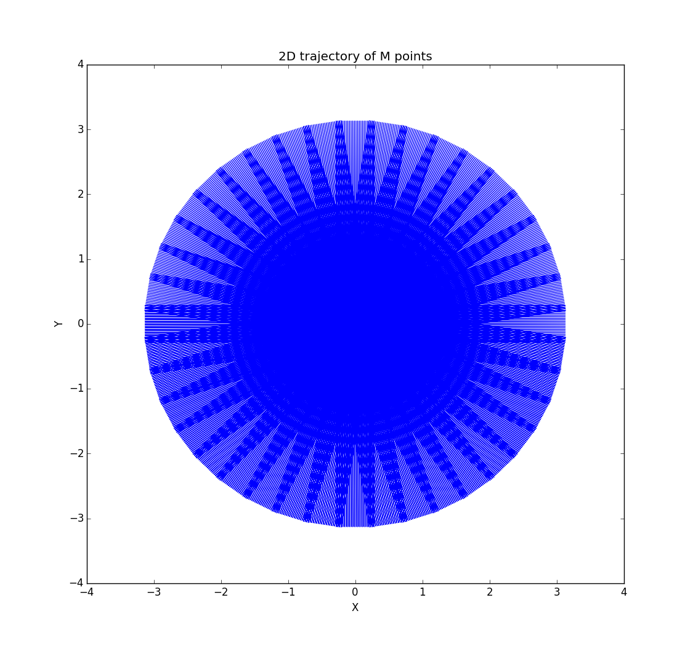
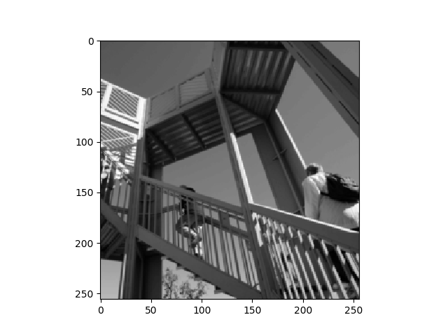

A 2D example
============
**Import pynufft module**

In python environment, import pynufft module::
   
   import numpy
   import pynufft.pynufft as pnft
   
Create a pynufft object NufftObj::

   NufftObj = pnft.NUFFT()
  
**Loading the X-Y locations("om")**

It requires the x-y coordinates of :math:`M` points to plan NufftObj.

A 2D trajectory from my PROPELLER MRI research is provided in pynufft package.::
    
    # load the data folder
    import pkg_resources 
    # find the relative path of data folder
    DATA_PATH = pkg_resources.resource_filename('pynufft', 'data/')
    
    # now load the path om
    om = numpy.load(DATA_PATH+'om2D.npz')['arr_0']

The :math:`M` locations of non-uniform samples (:math:`om`) is an M x 2 numpy.ndarray ::

    print(om)
   
    [[-3.12932086  0.28225246]
    [-3.1047771   0.28225246]
    [-3.08023357  0.28225246]
     ....
    [-2.99815702  0.76063216]
    [-3.02239823  0.76447165]
    [-3.04663992  0.76831114]]
    
You can see the 2D :math:`M` locations by plotting :math:`x` versus :math:`y`::

    import matplotlib.pyplot as pyplot
    pyplot.plot(om[:,0], om[:,1])
    pyplot.title('2D trajectory of M points')
    pyplot.xlabel('X')
    pyplot.ylabel('Y')
    pyplot.show()    
    
As can be seen in :numref:`propeller_trajectory`:

.. _propeller_trajectory:

   
   The 2D PROPELLER trajectory of M points.

**Planning**

Provided :math:`om`, the size of time series (:math:`Nd`), oversampled grid (:math:`Kd`), and interpolatro size (:math:`Jd`) are:: 
    
    Nd = (256,256)
    Kd = (512,512)
    Jd = (6,6)

Now we can plan NufftObj with these parameters::
    
    NufftObj.plan(om, Nd, Kd, Jd) 

**Forward transform**

Now NufftObj has been prepared and is ready for computations. Let continue with an example.::
   
    import scipy.misc
    import matplotlib.cm as cm
    image = scipy.misc.face(gray=True)
    
    image = scipy.misc.imresize(image, (256,256))
    
    image=image.astype(numpy.float)/numpy.max(image[...])
    
    pyplot.imshow(image, cmap=cm.gray)
    pyplot.show()
    

This display the image :numref:`2d_example_image`.

.. _2d_example_image:

   The 2D image from scipy.misc.face()
   
   
   
NufftObj transform the time_data to non-Cartesian locations::

   y = NufftObj.forward(image)
   
The 2D non-Cartesian spectrum (:math:`y`) cannt be directly visualized. However, regular spectrum can be obtained by "regridding" of :math:`y`::

   k =   NufftObj.y2k(y)
   import matplotlib.colors
   k_show = numpy.fft.fftshift(k)
   pyplot.imshow(numpy.abs(k_show), cmap=cm.gray, norm=matplotlib.colors.Normalize(0, 1e+3))
   pyplot.show()

This shows the pre-normalized spectrum. :numref:`pre_compensated_spectrum`.

.. _pre_compensated_spectrum:

   
   Pre-compensated spectrum of non-Cartesian spectrum of :numref:`2d_example_image`
   
Note: A pre-compensated spectrum leads to adjoint nufft", which cannot recover the image. See below. 
   
**Adjoint transform**: *adjoint()* method

The adjoint transform is the reverse of forward transform::

   x2 = NufftObj.adjoint(y) 
   pyplot.imshow(x2.real,cmap=cm.gray) 
   pyplot.show() 

.. _adjoint:

   Adjoint transform of non-Cartesian spectrum does NOT recover :numref:`2D_example_image`

There are some distortions in the adjoint operation :numref:`adjoint`. It does NOT recover the original image in :numref:`2D_example_image`.
   
   
**Inverse transform through density compensation**: *inverse_DC()* method

A more sensible computation is density compensated image. Using the inverse_DC() method::

   x3 = NufftObj.inverse_DC(y)
   x3_display = x3*1.0/numpy.max(x3[...].real) 
   pyplot.imshow(x3_display.real,cmap=cm.gray) 
   pyplot.show()
   
.. _2D_inverse_DC:

.. figure:: ../figure/2D_ inverse_DC.png
   :width: 50 %

   Inverse transform through density compensated spectrum.
   
:numref:`2D_inverse_DC` is more close to :numref:`2D_example_image` as the uneven density of non-Cartesian samples has been corrected.
   
.. literalinclude::  ../codes/pnft_2Dtest.py
   