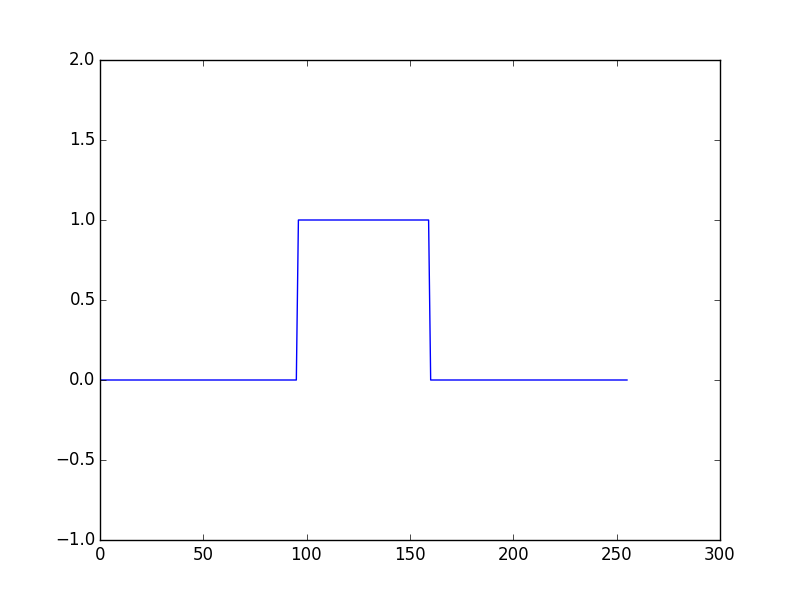
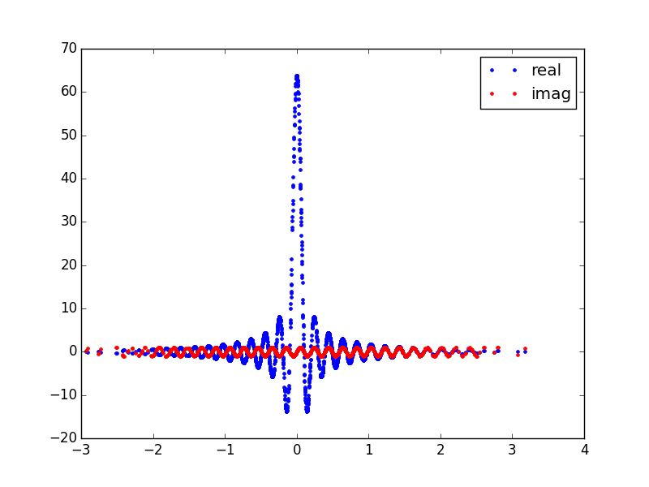
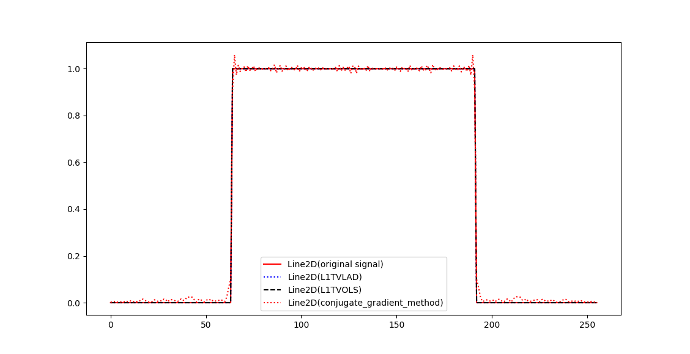

The 1D example
==============
**Import pynufft module**

In python environment, import pynufft module::
   
   from pynufft import NUFFT
   
Create a pynufft object NufftObj::

   NufftObj = NUFFT()
  

**Planning**

The :math:`M` locations of the non-uniform samples (:math:`om`) must be provided::

    import numpy
    om = numpy.random.randn(1512,1) 
    # om is an M x 1 ndarray: locations of M points. *om* is normalized between [-pi, pi]
    # Here M = 1512

In addition, the size of time series (:math:`Nd`), oversampled grid (:math:`Kd`), and interpolatro size (:math:`Jd`) are:: 
    
    Nd = (256,)
    Kd = (512,)
    Jd = (6,)

Now provide NufftObj with these parameters::
    
    NufftObj.plan(om, Nd, Kd, Jd) 

**Forward transform**

Now NufftObj has been prepared and is ready for computations. Continue with an example.::
   
   import numpy
   import matplotlib.pyplot as pyplot
   time_data = numpy.zeros(256, )
   time_data[96:128+32] = 1.0
   pyplot.plot(time_data)
   pyplot.ylim(-1,2)
   pyplot.show()

This generates a time series :numref:`box_function`.

.. _box_function:

   A box function time series
   
NufftObj transform the time_data to non-Cartesian locations::

   nufft_freq_data =NufftObj.forward(time_data)
   pyplot.plot(om,nufft_freq_data.real,'.', label='real')
   pyplot.plot(om,nufft_freq_data.imag,'r.', label='imag')
   pyplot.legend()
   pyplot.show()

This displays the non-Cartesian spectrum :numref:`non_Cartesian_spectrum`.

.. _non_Cartesian_spectrum:

   Non-Cartesian spectrum of box function in :numref:`box_function`. Note the non-uniform density.
  
   
**Signal restoration through "solve()"**

The signal can be solved by the solve() method ::

   restore_time = NufftObj.solve(nufft_freq_data,'cg', maxiter=30)   
   restore_time2 = NufftObj.solve(nufft_freq_data,'L1TVOLS', maxiter=30,rho=1)

Now display the restored signals::

   im1,=pyplot.plot(numpy.abs(time_data),'r',label='original signal')
   im3,=pyplot.plot(numpy.abs(restore_time2),'k--',label='L1TVOLS')
   im4,=pyplot.plot(numpy.abs(restore_time),'r:',label='conjugate_gradient_method')
   pyplot.legend([im1, im3,im4])
   pyplot.show()
   
.. _solve:

   Signals restored by "solve()". L1TVOLS and L1TVOLS are close to :numref:`box_function`, whereas cg is subject to distortion.
   

The complete code is:
   
.. literalinclude::  ../../../example/script_1D.py
   
