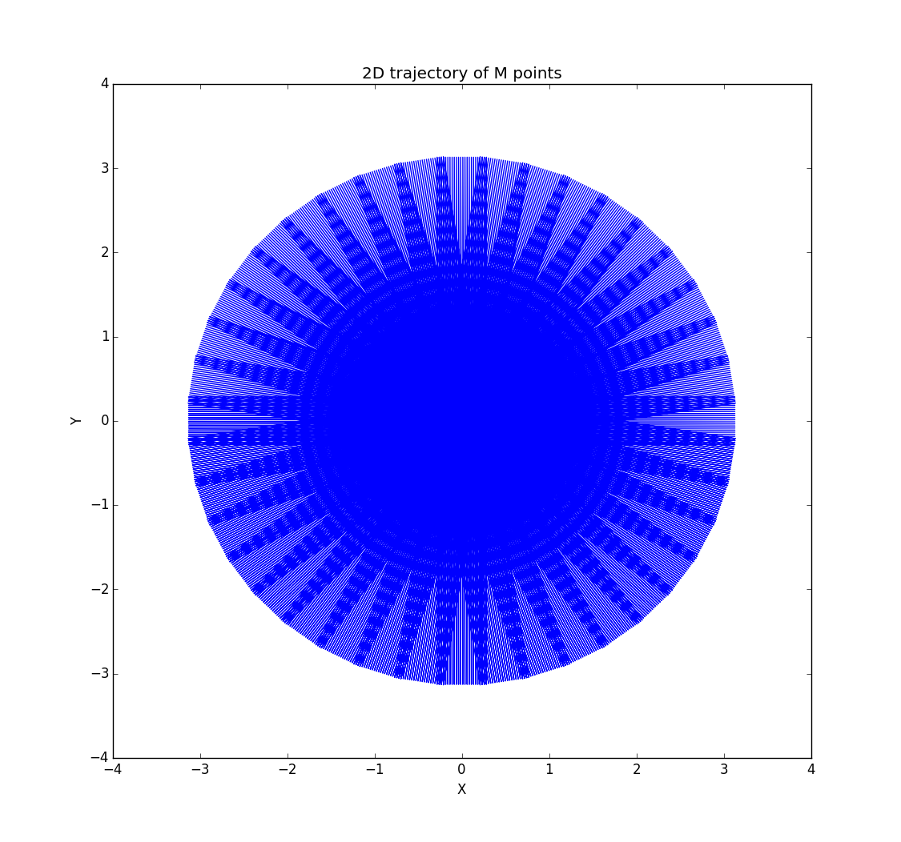
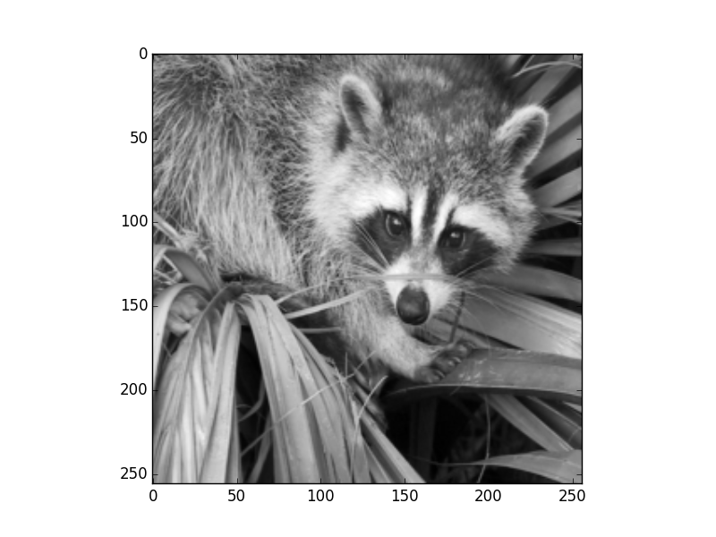
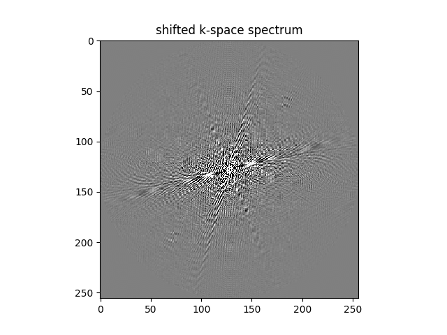

The 2D example
==============
**Import pynufft module**

In python environment, import pynufft module and other packages::
   
   
   import numpy 
   import scipy.misc
   import matplotlib.pyplot 
   
   from pynufft import NUFFT
   

  
**Loading the X-Y locations("om")**

It requires the x-y coordinates of :math:`M` points to plan NufftObj.

A 2D trajectory from my PROPELLER MRI research is provided in the pynufft package.::
    
   import pkg_resources
   DATA_PATH = pkg_resources.resource_filename('pynufft', './src/data/')
   om = numpy.load(DATA_PATH+'om2D.npz')['arr_0']

The :math:`M` locations of non-uniform samples (:math:`om`) forms an M x 2 numpy.ndarray ::

    print(om)
   
    [[-3.12932086  0.28225246]
    [-3.1047771   0.28225246]
    [-3.08023357  0.28225246]
     ....
    [-2.99815702  0.76063216]
    [-3.02239823  0.76447165]
    [-3.04663992  0.76831114]]
    
You can see the 2D :math:`M` locations by plotting :math:`x` versus :math:`y`::

   matplotlib.pyplot.plot(om[::10,0],om[::10,1],'o')
   matplotlib.pyplot.title('non-uniform coordinates')
   matplotlib.pyplot.xlabel('axis 0')
   matplotlib.pyplot.ylabel('axis 1')
   matplotlib.pyplot.show()
    
As can be seen in :numref:`propeller_trajectory`:

.. _propeller_trajectory:

   
   The 2D PROPELLER trajectory of M points.

**Planning**
Create a pynufft object NufftObj::

   NufftObj = NUFFT()
   
Provided :math:`om`, the size of time series (:math:`Nd`), oversampled grid (:math:`Kd`), and interpolatro size (:math:`Jd`) :: 
    
   Nd = (256, 256)  # image size
   print('setting image dimension Nd...', Nd)
   Kd = (512, 512)  # k-space size
   print('setting spectrum dimension Kd...', Kd)
   Jd = (6, 6)  # interpolation size
   print('setting interpolation size Jd...', Jd)
   

Now we can plan NufftObj with these parameters::
    
   NufftObj.plan(om, Nd, Kd, Jd)

**Forward transform**

Now NufftObj has been prepared and is ready for computations. We continue with an example.::
   
   image = scipy.misc.ascent()[::2, ::2]
   image=image/numpy.max(image[...])
   
   print('loading image...')
   
   matplotlib.pyplot.imshow(image.real, cmap=matplotlib.cm.gray)
   matplotlib.pyplot.show()
    

This displays the image :numref:`2d_example_image`.

.. _2d_example_image:

   The 2D image from scipy.misc.ascent()
   
   
   
NufftObj transform the time_data to non-Cartesian locations::

   y = NufftObj.forward(image)
   
**Image restoration with solve()**: 

The image can be restored from non-Cartesian samples y::

   image0 = NufftObj.solve(y, solver='cg',maxiter=50)
   image3 = NufftObj.solve(y, solver='L1TVOLS',maxiter=50,rho=0.1)
   
   image2 = NufftObj.adjoint(y ) # adjoint
   
   
   matplotlib.pyplot.subplot(1,3,1)
   matplotlib.pyplot.title('Restored image (cg)')
   matplotlib.pyplot.imshow(image0.real, cmap=matplotlib.cm.gray, norm=matplotlib.colors.Normalize(vmin=0.0, vmax=1))
   
   
   matplotlib.pyplot.subplot(1,3,2)
   matplotlib.pyplot.imshow(image2.real, cmap=matplotlib.cm.gray, norm=matplotlib.colors.Normalize(vmin=0.0, vmax=5))
   matplotlib.pyplot.title('Adjoint transform')
   
   
   matplotlib.pyplot.subplot(1,3,3)
   matplotlib.pyplot.title('L1TV OLS')
   matplotlib.pyplot.imshow(image3.real, cmap=matplotlib.cm.gray, norm=matplotlib.colors.Normalize(vmin=0.0, vmax=1))
   
   matplotlib.pyplot.show()
   
.. _2D_restore:

.. figure:: ../figure/2D_ restoration.png
   :width: 100 %

   Image restoration through solve() 'cg', 'L1TVOLS', 'L1TVLAD' and adjoint().
   
The spectrum of the restored image:

.. _2D_spectrum:

   The spectrum of the restored image solved by cg.
   

   
   
.. literalinclude::  ../../../example/script_2D.py
   
