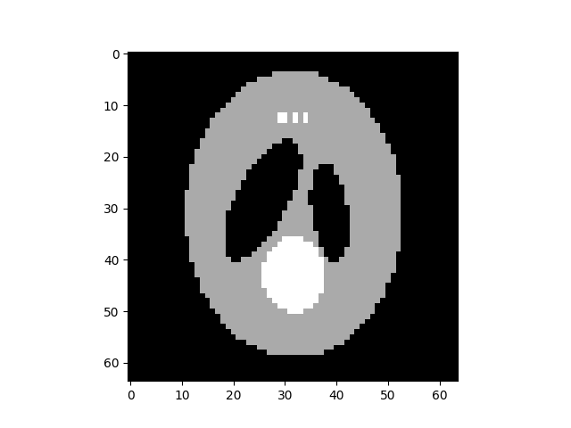

A 3D example
============

**Import pynufft module**

In python environment, import pynufft module and other packages::
   
   
   import numpy 
   import scipy.misc
   import matplotlib.pyplot 
   
   from pynufft import NUFFT
   

  
 
    
 
**Planning**

Create a pynufft object NufftObj::

   from pynufft import NUFFT
   NufftObj = NUFFT()
   

   
Provided :math:`om`, the size of time series (:math:`Nd`), oversampled grid (:math:`Kd`), and interpolatro size (:math:`Jd`) are:: 
    
   Nd = (64,64,64) # time grid, tuple
   Kd = (64,64,64) # frequency grid, tuple
   Jd = (1,1,1) # interpolator 
   #     om=       numpy.load(DATA_PATH+'om3D.npz')['arr_0']
   om = numpy.random.randn(15120,3)
   print(om.shape)

Now we can plan NufftObj with these parameters::
    
   NufftObj.plan(om, Nd, Kd, Jd)

**Forward transform**

Now NufftObj has been prepared and is ready for computations. Continue with an example, as follows.::
   
  
   import pkg_resources
   DATA_PATH = pkg_resources.resource_filename('pynufft', './src/data/')   
   image = numpy.load(DATA_PATH +'phantom_3D_128_128_128.npz')['arr_0'][0::2, 0::2, 0::2]
   print(special_license)
    

This displays the image :numref:`3d_example_image`.

.. _3d_example_image:

   The 3D phantom
   
   
   
NufftObj transform the time_data to non-Cartesian locations::

   y = NufftObj.forward(image)
   
**Image restoration with solve()**: 

The image can be restored from non-Cartesian samples y::

   restore_image = NufftObj.solve(kspace,'cg', maxiter=500)
   
   # 
   restore_image2 = NufftObj.solve(kspace,'L1TVOLS', maxiter=500,rho=0.1)
   pyplot.subplot(1,3,1)
   pyplot.imshow(numpy.real(image[:,:,32]), label='original signal',cmap=gray)
   pyplot.title('original')    
   
   pyplot.subplot(1,3,2)
   pyplot.imshow(numpy.real(restore_image2[:,:,32]), label='L1TVOLS',cmap=gray)
   pyplot.title('L1TVOLS')
   pyplot.subplot(1,3,3)
   pyplot.imshow(numpy.real(restore_image[:,:,32]), label='CG',cmap=gray)
   pyplot.title('CG')
   
    
   
.. _2D_restore:

.. figure:: ../figure/3D_ restore.png
   :width: 100 %

   Image restoration using'cg', 'L1TVOLS'.
   
   

   
   
.. literalinclude::  ../../../example/script_3D.py